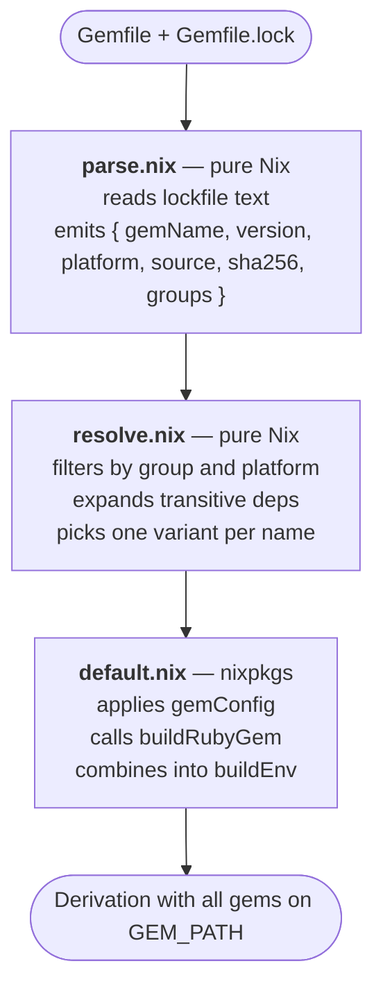

# Architecture

## Pipeline



## Key Design Decisions

1. Parse the lockfile in pure Nix (no bundix, no gemset.nix). Group extraction
   uses a Ruby IFD because Gemfile semantics are Bundler's domain.
2. Prefer precompiled native gems over source compilation.
3. Only apply gemConfig overrides to ruby-platform gems (precompiled gems
   should not need source build patches).
4. Delegate to nixpkgs' `buildRubyGem` and `defaultGemConfig` rather than
   maintaining custom builders.

## What We Use from Nixpkgs

- `buildRubyGem` -- builds individual gem derivations
- `defaultGemConfig` -- per-gem build overrides (nokogiri, grpc, etc.)
- `buildEnv` -- combines gem derivations into a single environment path

We reimplement lockfile parsing, group filtering, and platform resolution
because upstream assumes a `gemset.nix` generated by bundix. We parse the
lockfile directly.

## File Map

```
lib/gemfile-env/
  default.nix                     Orchestrator. Chains parse -> resolve -> build.
  parse.nix                       Lockfile parsing. Pure Nix, takes { lib }.
  resolve.nix                     Filtering and resolution. Pure Nix, takes { lib }.
  parse-gemfile-and-lockfile.nix  IO shell: readFile, runCommand, calls parse.nix.
  gem-configs.nix                 Local per-gem build overrides.
  gem-groups.rb                   Ruby IFD script for Gemfile group extraction.

test/
  helpers.nix                     Shared assertEq, assertThrows, fixtures.
  unit/test-parse-logic.nix       Unit tests for parse.nix.
  unit/test-resolve-logic.nix     Unit tests for resolve.nix.
  unit/test-pipeline-logic.nix    End-to-end parse + resolve tests.
  unit/test-{parse,resolve,pipeline}.nix  Wrappers that import logic + lib.
  fixtures/lockfiles/             Lockfile corpus for testing.
  integration/                    Integration tests with real gem builds.

examples/
  simple/                         Pure-ruby gems (rack, rake).
  medium/                         Native gems (nokogiri, puma, ethon).
  complex/                        Rails 8, git/path sources.
```
