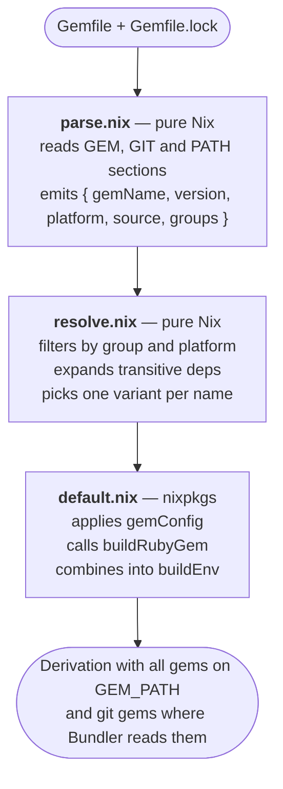

# Architecture

## Pipeline


```mermaid
flowchart TD
    input([Gemfile + Gemfile.lock])
    parse["<b>parse.nix</b> — pure Nix<br/>reads GEM, GIT and PATH sections<br/>emits { gemName, version, platform, source, groups }"]
    resolve["<b>resolve.nix</b> — pure Nix<br/>filters by group and platform<br/>expands transitive deps<br/>picks one variant per name"]
    build["<b>default.nix</b> — nixpkgs<br/>applies gemConfig<br/>calls buildRubyGem<br/>combines into buildEnv"]
    output([Derivation with all gems on GEM_PATH<br/>and git gems where Bundler reads them])

    input --> parse --> resolve --> build --> output
```

## Key Design Decisions

1. Parse the lockfile in pure Nix (no bundix, no gemset.nix). Group extraction
   uses a Ruby IFD because groups are not in the lockfile to read: Bundler's
   `Dependency#to_lock` never writes them and its `LockfileParser` reads every
   dependency back as `[:default]`. They live in the Gemfile, where arbitrary
   Ruby can produce them, so Bundler is what evaluates them.
2. Prefer precompiled native gems over source compilation.
3. Only apply gemConfig overrides to ruby-platform gems (precompiled gems
   should not need source build patches).
4. Delegate to nixpkgs' `buildRubyGem` and `defaultGemConfig` rather than
   maintaining custom builders.
5. Private-registry credentials go through `fetchurl`'s `netrcPhase`, so the
   secret reaches curl through a netrc in the build directory and never through
   the store. `buildRubyGem` builds its `src` from `source.remotes` and
   `source.sha256` alone, so a gem on a credentialed remote gets a `src` we
   construct instead. One netrc covers every credentialed remote of a gem,
   because `fetchurl` falls through to the next url on failure and a fallback
   with no credential is a bare 401. Since a netrc entry is one line, anything
   that could forge a second one is refused: the host, the variable names and
   the `netrcFile` path while Nix evaluates, and the variables' values in the
   build, which is the only place they exist.
6. `gemfileEnv` rejects an argument it does not declare. A consumer pinned to a
   version predating a feature has to learn that at the call site; the
   alternative is a successful evaluation that ignores the argument and fails
   somewhere else entirely.
7. A gem from a GIT or PATH section builds as an ordinary gem with a `src` we
   supply, not through `buildRubyGem`'s `type = "git"` or `pathDerivation`.
   Both of those install without a `specifications/*.gemspec`, which is the
   file RubyGems reads to find a gem on `GEM_PATH`, and `type = "git"` also
   wants a `sha256` that a `Gemfile.lock` does not record.
8. A lockfile gems4nix cannot honour is an evaluation error, never a gem
   quietly missing from the environment or fetched from somewhere the lockfile
   did not say. A hashless `CHECKSUMS` line no source claims, a `PLUGIN SOURCE`
   section, a `glob:` option, an unrecognised key on a source section, a gem
   two `GEM` sections both claim, and a hashed `CHECKSUMS` line no `GEM`
   section provides all throw. A dropped gem turns into a `LoadError` much
   later, in a layer that is not at fault.
9. Stay unopinionated about where that secret comes from. A consumer names
   either a file path (`netrcFile`, needing no daemon configuration) or two
   environment variables (needing no readable file). Both fail on different
   machines, so the choice belongs to the consumer, and each mode reports its
   own failure mode by name.
10. A git gem gets a second view of itself in `bundler/gems/<repo>-<shortrev>`,
    which is the only place Bundler reads one from, and the environment's
    setup hook exports `GEM_HOME` so Bundler looks there. Both views rather
    than one: moving the gem to satisfy Bundler would break the plain
    `require` that a consumer who never boots through Bundler relies on.
11. A `GEM` section's gems are its four-space spec lines, and its remotes are
    every `remote:` line it carries, reversed. Bundler looks up the
    last-declared source first and writes the lockfile first-declared first, so
    the reversal is what makes our list equal its own `remotes` and the fetch
    try the highest-priority remote first. A six-space line names a dependency
    another section may provide, so counting it as a gem here would claim this
    section's remote for a gem that is not on it.
12. A `RUBY VERSION` the lockfile and the `ruby` argument disagree on throws
    across the ABI and warns below it. Gems install under
    `lib/ruby/gems/<major>.<minor>.0`, so a difference there is every gem; below
    it, the requirement Bundler enforces is the Gemfile's rather than this
    value, which records only which Ruby resolution happened to run on.

## What We Use from Nixpkgs

- `buildRubyGem` -- builds individual gem derivations
- `defaultGemConfig` -- per-gem build overrides (nokogiri, grpc, etc.)
- `buildEnv` -- combines gem derivations into a single environment path

We reimplement lockfile parsing, group filtering, and platform resolution
because upstream assumes a `gemset.nix` generated by bundix. We parse the
lockfile directly.

## File Map

```
lib/gemfile-env/
  default.nix                     Orchestrator. Chains parse -> resolve -> build.
  parse.nix                       Lockfile parsing. Pure Nix, takes { lib }.
  resolve.nix                     Filtering and resolution. Pure Nix, takes { lib }.
  credentials.nix                 Private-registry credentials. Pure Nix, takes { lib }.
  arguments.nix                   Argument-surface strictness. Pure Nix, takes { lib }.
  parse-gemfile-and-lockfile.nix  IO shell: readFile, runCommand, calls parse.nix.
  gem-configs.nix                 Local per-gem build overrides.
  gem-groups.rb                   Ruby IFD script for Gemfile group extraction.

scripts/
  bundler-remote-order.rb         Measures how Bundler writes and reads a GEM
                                  section's remote order. Gated by the
                                  bundler-remote-order check.

test/
  helpers.nix                     Shared assertEq, assertThrows, fixtures.
  unit/test-parse-logic.nix       Unit tests for parse.nix.
  unit/test-resolve-logic.nix     Unit tests for resolve.nix.
  unit/test-pipeline-logic.nix    End-to-end parse + resolve tests.
  unit/test-credentials-logic.nix Unit tests for credentials.nix.
  unit/test-arguments-logic.nix   Unit tests for arguments.nix and gemfileEnv's argument surface.
  unit/test-pending-logic.nix     Known limitations, each asserted to still be one.
  unit/test-{parse,resolve,pipeline,credentials,arguments,pending}.nix  Wrappers that import logic + lib.
  fixtures/lockfiles/             Lockfile corpus for testing.
  integration/                    Integration tests with real gem builds.

examples/
  simple/                         Pure-ruby gems (rack, rake).
  medium/                         Native gems (nokogiri, puma, ethon).
  complex/                        Rails 8, git/path sources.
```
